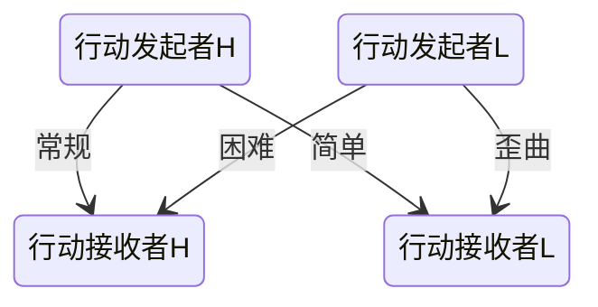

<strong>MahoushoujyoTranscendtheTimeTRPG</strong>

<strong>魔法少女超越时间</strong>

<i>“往往是那些善良的愿望，把人类带入了人间地狱。”——[德]荷尔德林</i>

<i>仅需购点方法完成角色建立、对抗骰法完成成功检定的，轻量化、模板化、对象化魔法少女TRPG规则

## 目录

* *“魔法少女超越时间！”*
* 购点法、对象、骰子与检定
* 基础世界观
	* 真实时间与魔女时间
	* 许愿、愿望与心愿类
* 角色构建
	* 属性
	* 学识与魔法
	* 特质
* 特质
* 学识
* 魔法
* 探索
	* 世界线
	* 环境
	* 地图
	* 检定
* 武力战斗
	* 检定
	* 变身
	* 武装
	* 必杀技
	* 流程
* 社交战斗
	* 检定
	* 施法
* 物品
* 魔物
* GM选项
* FAQ
* 附录：
	* 人物卡
	* 范例建卡流程
	* 特质表
	* 法术表
	* 物品目录
	* 魔物目录

​        

## “魔法少女超越时间！”

​		*“魔法少女超越时间，魔法少女是历史长河上的旅人。”*
​		从最初——emmm，虽说不一定有最初这个概念——从最初开始，魔法少女就天然具备前往过去与未来的力量。啊，这样的解释相当有误导性，我们还是用《最初魔法少女学说》（虽然在魔女那边这个叫做《最初魔女学说》）的研究来讲述一下这个世界的构成好了。
​		最初魔女是概念上最早出现的魔女，这与她出现在时间线上的哪一个时点无关：可能是在五千年前和轩辕、柏拉图等“最早”的魔女在同一段历史上，可能是在一万年后的某个城市里或者星球上，当然也不排除其实最初魔女就在我们同一段时间流上的可能性。
​		因为最初魔女具备了穿梭时间的能力，故而所有的魔法少女都因为与最初魔女的同源性而具备了在时间长河上“划船”的力量。魔法少女的观测证明了时间是一条长河，过去现在与未来分别在上游中游和下游；但反过来说，也可能正是因为时间是同一条河流，才导致了魔法少女的出现也不一定？
​		为了方便描述，我们虚构一条新的时间轴，称之为魔女时间轴。而我们原本的这条真实存在的时间轴，称为庸俗时间轴。
​		因为能够穿梭庸俗时间，庸俗时间是一条至始而终、无限长的河流，魔法少女可以改变过去与未来的历史，这会改变时间长河的流向——“正史派”魔法少女的主要任务，就是清除、阻止、说服试图改变河流的魔女们，以此来维持时间长河的正确流动。试图改变时间长河的魔女们有很多，最大的派别是被称之为《最优解》的魔女们（注：最优解一开始是由生活在人类史末期的魔女们提出的，她们共通的愿景是让人类史得以延续，她们自称为“领航员”，而后整个《最优解》派的魔女们都自称如此）。我们可以相信这样一个事实：现在的世界和未来的世界绝对不是理论上最好的世界、同样也绝对不是理论上最坏的世界。最优解魔女们的主要目的，就是通过从过去到未来不断的改变时间长河的流向，来逐渐接近所谓的最好的世界，并以此为基础，来达成她们自己的愿望。同样也有魔女仅仅是想要改变自己的过去，或者有心愿改变他人的历史，当然，也有魔女追求着《绝对末日》的存在。不过好在，泛世界史上最大最强最正义的魔法少女组织”正史观测者“不管是在过去还是未来，都一如既往地守护着时间长河的稳定！
​		魔法少女与凡人（mortal，魔女们对灵魂不能存续个人历史的普通人的称呼）不同，凡人无法感知到时间线的变化，故而在时间的伟力面前无从抵抗。正史派的一大诉求就是保护凡人，因为没有任何魔法少女与凡人们没有联系。时间长河的变化会产生、消灭、改变凡人，在正史派看来，时间长河的变化同时“杀死”了与她们有联系的凡人亲人与无数其他普通人——而非在一部分魔女的眼中凡人不算真正的人。对于魔法少女们而言，从她们许下愿望能够变身开始，她们的灵魂就得到了升华，能够记录个体经历过的所有时间和事件，存储为“个人历史”。故而魔法少女都是在时间线变化时才能感知到自己的资质，才能被其她魔法少女发现，引导上魔法少女的道路——当然也有天资卓绝者，自己成为魔法少女。
​		统计魔法少女的数量是完全做不到的事情，因为魔法少女们超越时间。因为魔法少女们存在于过去现在和未来。但为了让更多女孩子可以成为魔法少女，从文艺复兴时期开始，以莎士比亚为首的一系列魔法少女们，包括后来的爱茵斯坦、特斯拉小姐等，用了几个世纪的时间，战胜了神秘侧的魔女，让科学超越神秘成为时代的主流。这场战争就是升华之战。这是一场关乎真相与信念、现实与信仰的战争。参战双方为了全人类的心智与灵魂相互厮杀。她们紧握的武器不是利剑与长矛，也不是枪炮与炸药，而是词句与思想、理念与哲学。即便如此，战场上依旧尸横遍野，血流成河。硝烟散去后，过去的魔法少女用刀剑术法作战，现在的魔法少女用枪炮数学和网络作战。
​		划船的动作会在时间长河上溅起水花，水花是时间的间隙，从间隙中会产生魔物。魔物来自于幻想：来自于梦中、画中、影片中、文字中又或者是教科书中。魔物会产生时间流的错误信息，会伤害凡人、魔法少女乃至长河。对时间长河的影响越剧烈会产生越可怕的魔物，故而正史派对时空旅行本身就做出了严格的限定，任何未报备的时空穿梭都应该被制止，任何对时间流的影响都会被处罚（当然，不可能抓到每一次)。同时，正史派也有专门的魔物讨伐小队。
​		在时间流上交织形成的魔法少女关系网，就如同大河中点点闪烁的黄金。在流水的冲刷下，时间要抹平一切，有的黄金随水流飘走、有的黄金深埋在河床中、有的黄金越发纯粹。但纯粹真的是一件好事吗？

## 购点法、对象、骰子与检定

***M^T^t~T~T****是一个非常简单的规则。看完这一部分，你基本上就已经掌握了本规则的所有要点。*

### 购点法：

在***M^T^t~T~T***规则中，我们会使用**购点法**来完成角色卡的建立。对于玩家来说，是他们控制的玩家人物，对于GM来说，则包括了所有的NPC与魔物。是的，*在建立角色卡的时候，你并不需要考虑花费点数以外的任何东西。*

***M^T^t~T~T***的购点规则也十分简单，在三个购点部分（属性，特质，购物）都对点数的消耗做出了详细的说明：仅仅需要根据说明的数目支付点数即可。对了，在***M^T^t~T~T***中，点数更合适的称呼是**灵魂玉**。

如果你想要了解一下***M^T^t~T~T***购点法的设计，这也很容易说明。本规则的购点基本遵寻等差递增的方式：即+1需要支付1点，+2需要从+1再支付2点一共$1+2=3$点。同理，+7一共支付$ (1+2+...+7) = 28$点。在不同的情境下，则会用上述的数值乘以一个常数，比如：$\times 5$或者$\times10 $。而与增强无关的部分，大多完全相等于点数。

这很简单对吧？我们来看下一个部分吧。

*可选·x100*：为了看上去更加简单，***M^T^t~T~T***规则下的购点以1为基本单位。如果你想要看起来更多些——让玩家们更有满足感；或是发放奖励时更合理些，你可以简单地让灵魂玉的获取和消耗乘以100，也就是以100为基本单位。

### 对象：

在***M^T^t~T~T***规则中，所有的一切都是**对象**。这种设计是为了方便后续各种包括魔法少女、魔物和小狗、手枪和长剑等单位的统一化。

在各种单位的说明中，我们会阐明其是属于什么*类*的对象。而各种*类*的属性，将会在对象一章详细声明。这里，你只需要了解两种**对象**即可：**静态对象**与**动态对象**。

顾名思义，**静态对象**指的是不能够做出主动行动的单位，比如一块石头，或者一把长剑，或是一块土地。而**动态对象**指的是正在做出主动行动的单位，比如一位正在格挡敌人攻击的魔法少女，或者一把正在说话的长剑，她们就是动态对象。

到了这里，你肯定已经发现，**静态对象**与**动态对象**并不冲突，如果一位魔法少女能够且正在格挡敌人的攻击，那么她此刻是一个**动态对象**或称**动态单位**，她需要使用**双骰法**来对抗同为**动态对象**的敌人的**双骰法**检定。如果她未能察觉到敌人的攻击或是不准备格挡敌人的攻击等，那么她都没有*对敌人的主动行动响应一个主动行动——此时她被视为一个静态对象*，故将使用这位魔法少女在防御上的**双难度**来对抗敌人的**双骰法**检定。

**动态对象**使用**双骰法**，**静态对象**使用**双难度**。这也很简单对吧？至于为什么会出现*双*、什么是**双骰法**？什么是**双难度**？我们看到下一个部分就知道了，这与**优势**和**劣势**有关。

### 骰子与检定：

在***M^T^t~T~T***规则中，检定非常简单：不会出现联合检定或是多次检定。*一个行动的成功与否，永远仅需要一次检定。*

#### 优势与劣势：

所有的条目，都有**优势**和**劣势**两个子类，通常，**优势**结果与**劣势**结果并不相同。那么，如何判断是优势还是劣势呢？我们需要看在使用骰子与难度时，使用较好的那个还是较差的那个。

#### 成功/失败检定：双骰法与双难度：

所有的*成功/失败*检定、所有的首次投骰情境，都需要你投掷也仅仅投掷两次**d20**，加上对应的调整值。也即是：

$ result = D20 + X $

其中，调整值$X$的范围是$ -20 \sim 20$。若是理论调整值超过了这个数值，则在实际检定中，仍然只有其中的20点有效（这个规则有极高的优先度）。故，任何此种骰子的结果都会在$ -19 \sim 40$内浮动。

投掷完毕后，你会得到两个结果$ result1$与$result2$，这两个结果常常会有一个高（简称为H(*High*)）一个低（简称为L(*Low*)）——这便是**优势骰H**与**劣势骰L**。假设调整值$X$在**优势**与**劣势**下的调整值都一致（通常如此），那么仅有$\frac{1}{20}$的可能，H与L是一致的，在此情况下，我们直接视为H=L。更近一步地，我们看两次骰子的$D20$的结果，仅有$\frac{1}{400}$的可能性，玩家投出H$D20$=L$D20$=20或是H$D20$=L$D20$=1，对于这种情况，我们视为**绝对成功**与**绝对失败**——不再需要响应*行动*，也不需要考虑调整值$X$。

在对象中，我们提到过，所有*行动*的提出方，因为其必然是由一个**动态对象**动态提出，故都需要进行**双骰法**检定。而对于*行动*的接受方，会相应，若是其主动响应了*行动*，则其必然是由一个**动态对象**动态提出，故进行的对抗检定也是**双骰法**检定；而若是*行动*的接受方被动响应了*行动*，则无论其是**动态对象**或是**静态对象**，因为其静态成分，故其是两个固定值（也即**双难度**）。

那么，任何检定，都必定会出现四个数值，两个由行动发起者提供，两个由行动接受者提供。它们的比较关系由下表列出：

可见，一共有四种情况，它们分别意味着，**优势**对抗**优势**，**优势**对抗**劣势**，**劣势**对抗**优势**，**劣势**对抗**劣势**。当你使用**优势骰**，这同时意味着你需要使用**优势**条目下的结算结果。反之，当你使用**劣势骰**，这同时意味着你需要使用**劣势**条目下的结算结果。

具体使用那种对抗形式，根据情况的不同而不一样，但通常，我们都使用**优势**对抗**优势**，因为我们相信任何主动行动者，都会尽力做好自己的行动。

*可选·难度开关*：对于GM而言，这种设计有一个显而易见的调整难度的方式：将所有**常规对抗**改为**困难对抗**、**简单对抗**改为**常规对抗**即可增加难度，反之即可降低难度。但需要注意，这种调整会明显改变游戏的平衡。

*可选·单骰法*：若是GM觉得双骰法还是困难，你可以改为单骰模式。但这真不一定会降低游戏本就很低的复杂度。

最后这个好像复杂了一点点，但应该也还好？到了这里，我相信你已经基本懂得这个规则怎么游玩了。

我们正式开始吧？

## 基础世界观

### 真实时间与魔女时间

***“时间是一种细察和检验人类成就的方式。”——布鲁斯·雪莱《基督教会史》***

### 魔法少女与魔女

#### 魔法少女的诞生：

​		“在祂诉说出祂的心愿之时，这**愿望**本身构成了祂新的**躯壳**。魔法少女的**灵魂**就从这崭新的**躯壳**中诞生，构成祂的**灵魂宝石**，祂的**个人历史**就从那**时间长河**中复制出来，存贮到**灵魂宝石**之中。她是从过去的祂之中诞生出的，为了心愿而前进的全新的她。这就是魔法少女诞生的时候，也就是我们所说的**觉醒之刻**。”

​		魔法少女的诞生，是通过一个名为**觉醒之刻**的仪式进行的。这个仪式本身并没有任何需要准备的或是在意的地方：它的仪式性仅仅在于每一个魔法少女都是在此阶段饱含真心地许下了自己的心愿，以及必定在许愿时发生了时间线变迁。在这一刻她许下的愿望具备质量，构成了她的身体；她的新生灵魂用于保留她的个人历史；她的精神与思想决定了她的魔力与能力。因为**觉醒之刻**只有在时间线变迁时才能出现，时间线变迁又必然会产生魔物，故有魔法少女认为魔物和魔法少女本质相同。

​		魔法少女都是从**凡人**中诞生的，也就是说，魔法少女在诞生前都具备一个她的**凡人**身份。但在**觉醒**过后，魔法少女与其凡人身份就是两个截然不同的个体。成为魔法少女是灵魂的诞生，**凡人**则没有灵魂。

#### 魔法少女的升华：

​		魔女进阶超凡与伟大的必由之路。

#### 魔法少女的数量：

​		魔法少女无限多，但魔法少女A只有一个。

#### 灵魂宝石与个人历史：

​		灵魂宝石是魔法少女存在性的证明。对“个人历史”的准确表述应该是，时间长河这个混沌系统为了让魔女A出现，需要可能性怎么坍缩。然后把这些可能性打包，复制到她的宝石里。既然是可能性坍缩的打包，正史是什么样子其实无关紧要（只要时间长河往那个方向变过，她就诞生了）“个人历史”分为两个部分，刚刚说的是“诞生”前，“诞生”后的历史为这个魔法少女自身的经历。

​		因此，魔法少女的死亡与她的所有可能性消失相等价，故魔法少女的死亡不会在世界的历史上有任何记录，因为她的个人历史已不存在，但在其她魔法少女的个人历史中可能存在。

#### 魔法少女的愿望和质量：

​		魔法少女的许愿具备质量，完成愿望、放弃愿望或是灵魂寿命耗尽（等价于愿望没有实现）会归还质量。

### 许愿、愿望和心愿类

***“诚者，真实无妄之谓。”——《朱子语类·中庸三》***

#### 愿望的实现过程：

​		魔法少女是在许愿的同时诞生。魔法少女的愿望需要靠魔法少女自己去完成。在这个世界上不存在什么真正意义上的“许愿机”，魔法少女的愿望也自然不是在提出后由世界来完成。这个世界只是借予了魔法少女质量，给予她们一个*真正的机会*，通过这个机会，魔法少女得自己去思考自己的愿望到底是什么，自己的愿望需要用何种方法，以何种形式而实现。

#### 愿望的完成与实现：

​		愿望的实现的判断标准，是需要*主客观相统一*的。具体来说，需要魔法少女主观上认为自己的愿望达成了，同时客观上，这个愿望也切实达成了。这两者的同时满足，证明了魔法少女的愿望实现了。若是仅仅主观完成或是客观完成，魔法少女都会更为容易因为认知的冲突而陷入**歪曲**。

​		魔法少女的愿望是具备质量的，这些质量是从世界中借的。故，在魔法少女完成愿望后，她需要归还这些质量。然后她会失去魔法少女的身份，重新成为混沌概率之中的**凡人**。重回凡人的她将不再有灵魂宝石形成后的个人历史的记忆，也即她会忘记她成为魔法少女的事件与经历。但她的灵魂宝石将会永远留存在魔女时间轴上，作为她存在的证明，而这种存在的证明会在凡人的她的

#### 愿望的放弃：

​		放弃愿望，是魔法少女自愿自发的行为：她不愿意再继续为自己的愿望而前进了。在这种情况下，她可以选择归还从世界中借取的质量，而后放弃魔法少女的身份，重新成为混沌概率之中的**凡人**。

#### 愿望的改变：

​		魔法少女会在**觉醒之刻**许下自己的愿望，那么，这个愿望能够改变吗？应该怎么改变呢？

#### 许愿、愿望与需求：

​		***”致敬伟大魔女亚伯拉罕·马斯洛与她的后继者们对魔法少女愿望本质对其能力的影响做出的卓越研究。“***

​		在MTTT规则中，祈愿是一个力图被融入到规则下的部分。我希望祈愿不单单只是背景与扮演的一部分，更希望愿望本身就能够对人物的构成产生影响：由此试图写出以下部分的规则。

​		在这个世界上，愿望有很多种，许愿的形式也不尽相同。但，所有的愿望都能够被表述成这样的一种形式：

<strong>“我想要”+对象+对象的状态

​		这样可能不太直观，我们可以用一群例子来说明一下。

​		例子1 。“世界和平！”，“我，我的愿望是，希望世界和平！”，“如果，世界可以和平，那就太好了。”对于以上几个等价的愿望，我们都可以表述成：”我想要世界和平。“这样一种形式。其中，愿望的主体是”我“，世界和平是”我“想要的。对象是”世界“，”我“的愿望的目标是对世界的。对象的状态是”和平“，”我“对”世界“想要做到的是什么呢？”和平。“想要的是”世界“变得”和平“。

​		例子2 。“我想要个妹子！”在这个例子中，我们好像没有找到对象的状态。对象是“妹子”，那“妹子”的状态呢？注意在这里我们要留意住所有的愿望的主体都是“我”。故这里只是省略了对象的状态。也就是“我想要个妹子（被我所有）！”

​		那么，通过这种方法，我们有效地统一了世界上所有的愿望形式！于是，愿望表述的形式本身不再是阻止魔法少女们一起建造巴别塔的原因了！

​		既然已经有了一个愿望，我们就得想想，这个愿望，是为了满足我们的什么需求而提出的？

​		人本主义的心理学家们曾经提到过，人类的一切活动，都是有其对应的需求的。在他们看来，生命，是需要有追寻意义的意志的。其中的代表人物，马斯洛就曾经提出过，需求层次的理论。他与他的后继者们，认为人类的一切活动都是为了满足：

​		**生理需求，安全需求，社会需求，自主需求，审美需求，认知需求，自我实现与自我超越。**

​		这八类需求的。而魔法少女愿望的本质，也是为了满足她的某类或某几类需求。

​		比如，”我想要保护好爸爸妈妈。“就是典型的，可以满足安全需求和社会需求的愿望：让父母的生命不受威胁，是典型的对安全的需要，而作为社会身份的一部分，拥有父母的魔法少女确实更好地能够满足社会需求。其它的愿望，也同样地，会满足一个或多个需求。

​		而对需求的满足，在需求上的意识程度与重视程度，对魔法少女的能力影响是巨大的。重视生理需求的魔法少女往往会有更优秀的基底，重视安全需求的则会更加擅长于战斗，重视社会的谈吐过人，重视认知的学识丰厚……自我实现者，会更清楚自己想要的是什么。而自我超越者，是在需求上的升华，是对，只有超凡魔女们，才真正地拥有并在行动上为此类愿望付出一切。

​		回到规则上来，在前文我们讨论了两点，第一点是愿望形式的共通性，第二点是愿望对需求的满足性。以上两点构成了我们的规则基础。魔法少女在许愿后，需要更加真切地了解自身的心愿与诉求，包括其对何种”需要“的满足。这些具体呈现在规则上，就是魔法少女的**心愿类**的选择。

​		人物能够选择什么心愿类，是与她的愿望紧密联系的：一个“我想要保护我的妹妹。”这样的愿望，是很难说服GM与其她人，这个愿望涉及到了*自主需求*或是*认知需求*的——在选择心愿类时，请务必与GM与其她的魔法少女伙伴们协商。在选择心愿类时，首个心愿类是免费的，后续追加心愿类的选择，需要付出逐渐增加的灵魂玉。其中，自我超越类是在追加心愿类的前提之外，额外有着超凡魔女阶位的前置要求的。

​		而在心愿类带来的人物卡影响上，是视为叠加取优的：例如同时重视生理需求与认知需求的魔女，享受这两个心愿类带来的全部好处，若有重叠部分则取优。在共性上，所有的心愿类都是一系列**特质**与**法术**的前提条件，拥有某项心愿类让你可以选择以其为前提的相关人物卡构件。此外，还有一些其它的收益。

**选取新的心愿类的消耗：**

| 已有心愿类数量 | 消耗 |
| -------------- | ---- |
| 0              | 0    |
| 1              | 200  |
| 2              | 500  |
| 3              | 1000 |
| 4              | 1500 |
| 5              | 2000 |
| 6              | 3000 |
| 7              | 5000 |

**心愿类的功能：**

| 心愿类   | 描述                                                         |
| -------- | ------------------------------------------------------------ |
| 生理     | 允许你选择以此为前提的构件。重视生理者，对自身基底的看重让你在购买属性点时的消耗-2。 |
| 安全     | 允许你选择以此为前提的构件。重视安全者，对战斗的看重让你在武装强化时的消耗-3。 |
| 社会     | 允许你选择以此为前提的构件。重视社会者长于交际属性，在社交战斗时得到+2的心愿加值。 |
| 自主     | 允许你选择以此为前提的构件。重视自主者长于魔法属性，在魔法知识技能强化时的消耗-3。 |
| 审美     | 允许你选择以此为前提的构件。重视审美者长于魅力属性，在购买服饰时得到5%的优惠。 |
| 认知     | 允许你选择以此为前提的构件。重视认知者长于学识属性，在学识技能强化时的消耗-3。 |
| 自我实现 | 允许你选择以此为前提的构件。你对自身有着清晰的规划，可以选择任何需求非自我超越类为前提的构件，但任何非自我实现类的构件购买时消耗增加30%。 |
| 自我超越 | 允许你选择以此为前提的构件。                                 |

## 角色构建

### 购点数

| 开始故事时魔法少女的阶位                                     | 灵魂玉数量 |
| ------------------------------------------------------------ | ---------- |
| *诞生*：从魔法少女的诞生开始游戏，这时的魔法少女能力可能弱小，但心愿也足够坚定。 | 100        |
| *行进*：魔法少女正在努力完成心愿的途中，她会遇到各式各样的伙伴与敌人。 | 1000       |
| *超凡*：相比一般的魔法少女，这些魔法少女对自我愿望的规划很高， | 2500       |
| *伟大*：这些魔法少女的愿望已经开始触及了自我超越的类别。     | 5000       |
| *自定义*：构建属于你自己的魔法少女！                         | ？？？     |

​		灵魂玉等价于购点，也即：`1灵魂玉 = 1点`

##### 克尔凯郭尔定义：

| 阶段     | 对应                                                         |
| -------- | ------------------------------------------------------------ |
| 诞生阶位 | 审美存在（或称感性存在）阶段                                 |
| 行进阶位 | 审美存在（或称感性存在）阶段到伦理存在（或称理性存在）阶段   |
| 超凡阶位 | 伦理存在（或称理性存在）阶段到信仰存在（或称宗教性存在）阶段 |
| 伟大阶位 | 信仰存在（或称宗教性存在）阶段                               |

##### 马斯洛定义：

| 阶段           | 对应           |
| -------------- | -------------- |
| 诞生到超凡阶位 | 自我超越前阶段 |
| 伟大阶位       | 自我超越阶段   |

### 建卡

​		建卡非常简单，把所有的灵魂玉花到属性、特质和物品三个方面上，花完就好了！

#### 属性：

| 类\样    | 正位 | 倒位 | 基底 |
| -------- | ---- | ---- | ---- |
| **生理** | 力量 | 敏捷 | 体质 |
| **精神** | 学识 | 魔法 | 认知 |
| **社交** | 魅力 | 交际 | 意志 |

##### 购点：

​		所有的属性基底为10，然后开始加点。加到11点需要2点灵魂玉，加到12点需要加到11的2点灵魂玉与11到12的4点灵魂玉一共6点灵魂玉。同理，我们可以推得，希望从10点力量加强到17点力量一共需要：

$ 2*(1+2+...+7) = \frac{(1+7)*7}{2} = 56 $

​		点灵魂玉。

​		在下方的表格中，详细列出了每一级相对上一级的消耗，以及从10点开始，到达目标级数的总消耗。

| 属性点数   | 灵魂玉花费 | 总花费 |
| ---------- | ---------- | ------ |
| 6          | -2         | -8     |
| 7          | -2         | -6     |
| 8          | -2         | -4     |
| 9          | -2         | -2     |
| 10（基础） | 0          | 0      |
| 11         | 2          | 2      |
| 12         | 4          | 6      |
| 13         | 6          | 12     |
| ……         | ……         | ……     |
| 19         | 18         | 90     |
| 20         | 20         | 110    |
| ……         | ……         | ……     |
| 30         | 40         | 420    |

*可选~天资*：在三类属性中，可以选出优势类和劣势类，前者每次升级-2点消耗，后者每次升级+2点消耗。

##### 概述：

​		在MTTT中，因为点数的花费只有属性、特质和购物三个方面，故我们可以算出，一共需要$ 210*9*2 = 3780$点灵魂玉即可完成所谓的*终极角色*的构建——仅在属性上。

##### 描述：

###### 力量：

太基础了，不知道怎么写好。

###### 敏捷：

太基础了，不知道怎么写好。

###### 体质：

太基础了，不知道怎么写好。

###### 学识：

太基础了，不知道怎么写好。

**学识属性等级与获得学识点：**
		其实就相等于你在学识属性上花费的$ 总灵魂玉数量+10 $，等于是，仅需在10点后开始，每次将相等于投入灵魂玉数量的点数，加到特定的知识技能上就好。

| 学识属性等级 | 总灵魂玉 | 总学识点 |
| ------------ | -------- | -------- |
| 10           | 0        | 10       |
| 11           | 2        | 12       |
| 12           | 6        | 16       |
| 13           | 12       | 22       |
| ……           | ……       | ……       |
| 19           | 90       | 100      |
| 20           | 110      | 120      |
| ……           | ……       | ……       |
| 30           | 420      | 430      |

**学识点与特定知识技能等级**：

| 特定类别的知识技能等级 | 学识点花费 | 从0级开始的总花费 |
| ---------------------- | ---------- | ----------------- |
| 0                      | 0          | 0                 |
| 1                      | 2          | 2                 |
| 2                      | 4          | 6                 |
| 3                      | 6          | 12                |
| 4                      | 8          | 20                |
| 5                      | 10         | 30                |
| 6                      | 12         | 42                |
| 7                      | 14         | 56                |
| 8                      | 16         | 72                |
| 9                      | 18         | 90                |
| 10                     | 20         | 110               |

###### 魔法：

太基础了，不知道怎么写好。

**魔法属性等级与获得法术点：**
		其实就相等于你在魔法属性上花费的$ 总灵魂玉数量+10 $，等于是，仅需在10点后开始，每次将相等于投入灵魂玉数量的点数，用于习得特定的法术就好。

| 魔法属性等级 | 总灵魂玉 | 总法术点 |
| ------------ | -------- | -------- |
| 10           | 0        | 10       |
| 11           | 2        | 12       |
| 12           | 6        | 16       |
| 13           | 12       | 22       |
| ……           | ……       | ……       |
| 19           | 90       | 100      |
| 20           | 110      | 120      |
| ……           | ……       | ……       |
| 30           | 420      | 430      |

**法术点与特定法术等级**：

| 指定法术等级 | 需求属性前提 | 法术点花费 |
| ------------ | ------------ | ---------- |
| 1            | 10           | 2          |
| 2            | 12           | 6          |
| 3            | 15           | 10         |
| 4            | 17           | 14         |
| 5            | 20           | 18         |
| 6            | 22           | 22         |
| 7            | 25           | 26         |
| 8            | 27           | 30         |
| 9            | 30           | 34         |

###### 认知：

太基础了，不知道怎么写好。

###### 意志：

太基础了，不知道怎么写好。

###### 交际：

太基础了，不知道怎么写好。

###### 魅力：

太基础了，不知道怎么写好。

#### 特质：

##### 核心：

​		基于个人的灵魂宝石，魔法少女通过法术力将特定的符文输入到灵魂宝石的外层上，构筑出能力倾向与能力强化的效果。魔法少女能在核心上装备的效果基本决定于她们的心愿类。

​		核心分为两个部分，一个内环作为**主系符文**，三个外环作为**支系符文**。正如图中所示，一个魔法少女可能懂得多个主系或支系符文，但同一时刻生效的，分别只有1/3个。

​		一般而言，主系仅提供被动常驻效果，而支系有可能提供主动能力，也可能提供被动效果。此外，主系可以对支系有所约束，而支系通常不对主系产生约束。

##### 其它：

​		其它特质通常都是用于个性化不同的魔法少女，这些都是一些类似于专长或是被动效果的特质。通过花费灵魂玉，所有习得的此类特质都被动常驻起效。

具体项目请看特质一章。

## 特质

***“每个人都有他的隐藏的精华，和任何别人的精华不同，它使人具有自己的气味。”——罗曼·罗兰***

### 定义

## 学识

### 定义

​		学识通常就是我们所说的”技能“。是魔法少女在各种条件下，为了得知她们是否能够了解相关行动或是相关知识的数值化表述。

## 魔法

***“我相信，能打败黑暗的，不是强大的魔力，而是生活中的小事和微小的爱。”——甘道夫《霍比特人》***

### 法术

​		过于基础的东西反而不知道怎么写好。

#### 法术的分类：

​		*”感谢色相学魔女孟塞尔小姐提出的魔力色彩分类方法，以及孟塞尔色立体。“*

​		过于基础的东西反而不知道怎么写好。红色趋向战斗与强化，黄色趋向对事物的操控，绿色趋向生理与成长，蓝色趋向认知与法术本身，紫色趋向社交生活。

| 颜色 | 标识 | 对应       |
| ---- | ---- | ---------- |
| 红色 | R    | 战斗与强化 |
| 黄色 | Y    | 物质与操控 |
| 绿色 | G    | 生理与成长 |
| 蓝色 | B    | 认知与法术 |
| 紫色 | P    | 社交与精神 |

### 施法

​		过于基础的东西反而不知道怎么写好。

### 法术力与法术力池

​		法术力是魔法少女们施法时的常规消耗，也是通常情况下的唯一消耗。驱动法术的法术力就像驱动电器的电能，电能存储于电源中，法术力存储于法术力池中。
​		每一位魔法少女都有属于她个人的法术力池，其容量大小决定了魔法少女的法术力上限与总量。除却个人的法术力池，通过一些法术或是物品，还有一些独立于魔法少女法术力池的法术力池存在。

#### 法术力池的容量：

​		魔法少女的法术力池的总量是随魔法少女的魔法属性逐渐呈指数增长的。

| 魔法属性值 | 法术力池容量 | 魔法属性值 | 法术力池容量 |
| ---------- | ------------ | ---------- | ------------ |
| 10         | 20           | 21         | 86           |
| 11         | 21           | 22         | 98           |
| 12         | 23           | 23         | 111          |
| 13         | 26           | 24         | 125          |
| 14         | 30           | 25         | 140          |
| 15         | 35           | 26         | 156          |
| 16         | 41           | 27         | 173          |
| 17         | 48           | 28         | 191          |
| 18         | 56           | 29         | 210          |
| 19         | 65           | 30         | 230          |
| 20         | 75           |            |              |

#### 法术力池的活化：

​		魔法少女的法术力池的活化上限是随魔法少女的魔法属性逐渐呈对数增长的。

| 魔法属性值 | 活化上限容量 | 魔法属性值 | 活化上限容量 |
| ---------- | ------------ | ---------- | ------------ |
| 10         | 5            | 21         | 28           |
| 11         | 11           | 22         | 29           |
| 12         | 16           | 23         | 29           |
| 13         | 20           | 24         | 29           |
| 14         | 23           | 25         | 29           |
| 15         | 25           | 26         | 30           |
| 16         | 26           | 27         | 30           |
| 17         | 27           | 28         | 30           |
| 18         | 27           | 29         | 30           |
| 19         | 28           | 30         | 30           |
| 20         | 28           |            |              |

每回合活化感觉有点问题（沉思

| 魔法属性值 | 每回合活化 | 魔法属性值 | 每回合活化 |
| ---------- | ---------- | ---------- | ---------- |
| 10         | 5          | 21         | 8          |
| 11         | 6          | 22         | 8          |
| 12         | 6          | 23         | 8          |
| 13         | 6          | 24         | 8          |
| 14         | 6          | 25         | 8          |
| 15         | 6          | 26         | 9          |
| 16         | 7          | 27         | 9          |
| 17         | 7          | 28         | 9          |
| 18         | 7          | 29         | 9          |
| 19         | 7          | 30         | 10         |
| 20         | 7          |            |            |

#### 法术力的分类：

​		魔法少女的所有法术都需要消耗法术力，而法术力分为两类，即**秩序法术力**与**歪曲法术力**。这两者构成了法术力池的正反两面。通常情况下，一位魔法少女有着同等容量的**秩序法术力**与**歪曲法术力**池上限。

​		魔法少女的施法都与这两种法术力相联系。具体对每种法术力都有*增长*、*无关*、*消耗*三种形式。下表是法术与法术力关联程度以及法术的常见程度的对照表。

| 级别 | 常见程度                                     |
| ---- | -------------------------------------------- |
| 0    | 不存在                                       |
| 1    | 非常罕见，基本没有                           |
| 2    | 不常见，但还是能找到。                       |
| 3    | 通常是一些特殊的学派法术，为了达成特殊效力。 |
| 4    | 常见。                                       |
| 5    | 非常常见，易于研究创新。                     |

| 关联     | 秩序消耗 | 秩序无关 | 秩序增加 |
| -------- | -------- | -------- | -------- |
| 歪曲消耗 | 3        | 2        | 1        |
| 歪曲无关 | 5        | 0        | 2        |
| 歪曲增加 | 4        | 3        | 0        |

#### 秩序/歪曲：

​		**秩序/歪曲比**过低会导致魔法少女歪曲化。

| 比例 | 效果   |
| ---- | ------ |
| 1    | 无     |
| 3/4  | 歪曲+0 |
| 1/2  | 歪曲+1 |
| 1/4  | 歪曲+3 |
| 0    | 歪曲+5 |

### 法术格式

​		为了便于统一表述法术，在这一节中，我们确定了法术的基本格式，同时给出两个例子。

##### 法术名（ID）

*法术类：五色中选择，或混色——如：“R/P"*

**法术等级：**1-9
**法术力：**-X 秩序； -X 歪曲
**消耗与成分：**部分法术在法术力消耗以外的需求，包括可能的歌唱，或是材料，甚至是生命或是精神。
**法术类型：**常规、结界、场地、响应（？是否需要此部分）

**施法类型：**标准、瞬间、咏唱、合击（N）、仪式
**施法时间：**X小节
**持续时间：**0、X小节、X回合、X分钟、X小时……

**目标：**凡物、凡人、魔物、魔法少女、静态对象、动态对象、智慧生物……
**距离：**自身、近距、中距、远距……
**范围：**X米（球形，锥型，半球形……）
**锚点：**有（N）/无

**对抗检定：**无或 A vs B

**描述：**有些法术的有些效果不受优势劣势影响，则写在这里。
		**优势：**使用优势骰时的法术效果。
		**劣势：**使用劣势骰时的法术效果。

**法术常见度：**1-5
**学习前提：**学习该法术时，需要的技能等级以及
**学习花费：**

——”XXXXX！“

**实例：**有些法术因为其描述的原因，可能无法直观地让魔法少女知道如何施展，故这里会给出一个场景与使用法术的实例。

**例子：**

**闪电炼击**

*红色（R）*

法术等级：1
法术力：- 2 秩序
法术类型：常规

施法类型：标准
施法时间：6（小节）
持续时间：0

目标：一个动态对象
距离：近距
范围：无
锚点：无

对抗检定：魔法属性 vs 体质属性

描述：
		对目标造成3点伤害。

法术常见度：5
学习前提：魔法学1，电学1
学习花费：1

 —— “每个小魔女都应该掌握的简单战斗法术。”

**闪电击**

法术等级：7
法术力：- 2 秩序
法术类型：常规

施法类型：瞬间
施法时间：0（小节）
持续时间：0

目标：一个动态对象
距离：近距
范围：无
锚点：无

对抗检定：无

描述：
		对目标造成3点伤害。

法术常见度：3
学习前提：魔法学7，电学5，习得闪电炼击。
学习花费：7

——“火花魔女大叫着，呼唤着她年轻时的风暴之怒。令她意外的是：天空用她从未奢望复见的强大能量给予回应。”

## 探索

### 世界线：

### 环境：

### 地图：

## 武力战斗

*这一部分是武力战斗相关规则。*

### 介绍

### 流程

#### 开始

#### 准备阶段：

##### 阶段1：战斗准备

在战斗开始时，我们先进入**战斗准备**阶段。

其中的*第一步*，是确认所有参与战斗的**动态对象**的当前状态，包括属性、常驻效果和装备等。同时也要确定参战单位之间的**距离**。

然后我们开始进行*第二步*，确认所有参战单位的**法术力池**，包括各单位的法术力数量、法术力比值等。

*最后一步*，确定行动顺序——所有参与战斗的动态单位投掷**先攻**，根据先攻确定行动顺序——也即是轮执行者的顺序。

#### 主要阶段：战斗回合：

##### 阶段1：解放法力

根据**活化程度**（*通常基于魔法属性*）展开所有参战单位的部分**法术力池**，直到达到**活化上限** *（通常需要2-5个回合，且上限通常基于魔法属性）*，作为该回合该单位所能用的总法力量。（*一些**特质**可能能从上一个战斗回合处继承未被消耗的法力等。*）若部分法术力池已被展开，则补充法术力数量到允许的最大值。所有法术力的消耗最终都是法术力池的消耗，部分法术力池仅仅决定了每回合所能使用的最大法术力。

##### 阶段2：行动轮

根据行动顺位，依次执行各单位的**轮（turn）**，各个单位的轮合起来，构成了一个**回合（round）**。理论上，各个**轮**是同时进行的，同一回合内的每一个**轮**都对应着同一个6秒的时间。一个**回合**的用时即为6秒。

一个行动轮包括：轮开始，轮响应，获得小节，主动步骤（消耗小节），轮结束。一共5个部分。

在每一个**轮**开始后，结算所有该**轮**的执行者单位上的**轮响应**。

该**轮**的执行者会获得两组*平行*的6个**小节（bar）**，包括6个**小节**和6个**移动小节**。

因为动态对象的机动作战，我们可以认为所有单位都是同时在进行移动和执行动作的。同理，在此过程中的插入阶段也会同时影响行动和移动，不可能单独影响行动或是移动（即，有些玩家的表述会把行动和移动分开，但这并不意味着在这个‘分开’处的时点执行插入阶段能够仅仅影响行动或是移动。）

通过消耗**小节**，轮执行者得以执行动作，包括普通攻击，施法，使用物品等，这些都会消耗不同数目的**小节**。而**移动小节**这种确定了前提的小节，则只能单纯用于执行移动动作（*一些特质可能让玩家得以利用移动小节进行指定的其它行动*）。在消耗小节后，一般直接结算小节行动的结果。

当该轮的执行玩家消耗完毕所有的**小节**或是主动选择结束当前**轮**（未消耗的**小节**将被视为已经消耗）时，进入当**轮**的结束阶段。准备开始下一个执行权玩家的**行动轮**。

**轮**开始前，**轮**开始后，结算**轮响应**，轮执行者获得小节前后，消耗小节，**轮**结束前后，下一**轮**开始前——都是可以进行插入阶段的时点。（未注明*前*，*时*，*后*的则为时点均可。）

##### 阶段3：结算法力

在所有单位的**行动轮**都结束后，结算各个单位的剩余法力，法术力池影响。

然后开始下一个战斗回合，直到战斗结束。

##### 中途加入：在战斗回合中，出现新的参战单位的处理

无准备的加入战斗者：

有准备的加入战斗者：

##### 插入阶段：瞬间法术与战时触发效果

这是一个可能存在的阶段。

因为瞬间法术不消耗**小节**数，故只要法术力支持、施法条件支持，瞬间法术可以在**战斗回合阶段2：行动轮**中的任何**时点**使用。同理，因为战时触发效果不消耗**小节**数，故只要法术力支持、触发条件发生，战时触发效果将在任何最先它被触发的时点*响应*触发效果。当一个瞬间法术被施展、或一个战时触发效果被触发，我们视为进入了*中断（interrupt）*，将会先行处理该瞬间法术或战时触发效果。

具体来说，在任何单位准备行动、正在行动或是将要结束当前行动的同时，可能施展瞬间法术的单位都可以选择施展*（like push）*瞬间法术。同理，任何单位的行动都可能触发其它单位的战时触发效果，其它单位（可以）选择响应触发，结算效果。在施展瞬间法术（响应战时触发效果）的同时，任何单位（包括当前瞬间法术施展者本身）都可以在该瞬间法术准备结算的基础上堆叠*（like push）*更多的瞬间法术与/或响应更多的战时触发效果。

若没有其它瞬间法术被施展或战时触发效果被响应，则直接结算*（like pop）*该瞬间法术或战时触发效果，然后退出*中断*，回到回合中继续执行当前行动（若仍可执行）与后续行动。若有其它瞬间法术被施展或战时触发效果被响应，则遵循*堆栈（stack）*的原则，最后施展的瞬间法术或被响应的战时触发效果最先结算，然后依次判断次后施展的瞬间法术或被响应的战时触发效果的合法性，若是合法则依次结算。注意，在结算过程中，任意次序的瞬间法术或被响应的战时触发效果准备结算时，都可以在此结算时点上，插入*（like push）*更多的瞬间法术（但不可能响应相同的战时触发效果，因为其触发在上一次结算时点已经触发）。然后，继续根据*堆栈*的原则，依次处理*（like pop）*所有的瞬间法术与/或被响应的战时触发效果直到处理完毕，退出*中断*，回到当前战斗回合。

*可选·禁用插入阶段*：虽然由于法术力池与灵魂玉数量的限制，插入阶段不可能堆栈过多。但如果认为插入阶段过于繁琐、影响游戏体验，GM可以直接禁用这一阶段。由于这个阶段本身就是外挂在战斗规则之上，故不会对平衡产生过多影响。

#### 结束阶段：

##### 阶段1：战斗结算

在战斗结束后，统计各单位的状态，包括包括体力、属性、法术力池、常驻效果和装备等。

#### 结束

### 行动与小节

​		在这一部分，将会介绍各种战斗中会做出的行动，以及它们需要消耗的小节数（行动点数）

#### 攻击：

通常而言，攻击动作需要消耗6个小节。

#### 施法：

大部分的标准法术（spell）都需要消耗6个小节。

### 范例

