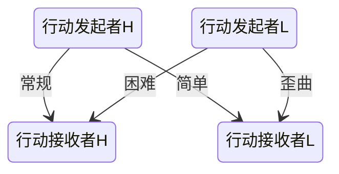

# 判定


### 骰子（Dice）

投骰子是用类似“3d4+3”的公式来描述的，它表示“投了3个四面骰并加3”（结果是6至15间的一个数）。第一个数字告诉你投几个骰子（把它们的结果加起来）。紧跟在“d”后面的数字告诉你使用的骰子类型。后面任何的数字表明结果中将要加上或减去的数值。
d%：百分骰的使用略有区别。你通过投两个不同的10面骰子产生一个1至100之间的数。其中一个骰子（在投之前决定）是十位数，另一个是个位数。两个0代表100。

### 小数的舍入(Rounding Fractions)

通常情况下，当你得到小数时要去掉小数部分，即使小数部分等于或大于0.5也是如此。例外情况都会额外说明。

### 乘法(Multiplying)

有时候规则让你乘一个数或一个投出的值。当只有一个乘数时，正常地乘那个数即可。而当有两个或多个乘数乘以任何抽象值（比如调整或投出的值）时，将这些乘数合并成一个单独的乘数，即每个额外的乘数减一后加到第一个乘数上。因此，一个2倍（×2）再加一个 2倍（×2）得到的是3倍（×3，因为 2 + 1 = 3）。
当乘数是现实中的值（比如重量或距离），替换以不同的乘法规则。这一部分依赖物理常识进行计算。


### 基本判定：成功/失败判定

MTTT中，本质上仅有一种判定，这里将会具体介绍它的作用。

我们先来复习一下：

>每当你试图进行一个有一定几率失败的动作时，你投两次20面骰子（d20）。
为了检测你的人物是否成功完成动作，你必须：
* 投两次d20
* 在每次d20加上任何相关的调整值
* 确定是优势还是劣势
* 拿结果与目标数值进行比较
>如果结果等于或大于目标数值，你的人物成功。若小于目标数值，那么你失败了。

在上文中，我们需要关注的是，“调整值”，“优劣”和“目标数值”究竟是什么。

#### 调整值：

在***MTTT***中，所有的成功/失败判定都依赖于目标的相关技能值和对应的属性调整值，偶尔也会有其它加值。其公式如下：
```math
result1,2 = d20+1*(该动作依赖的技能等级)+(1/2)*(该动作依赖的属性调整值)+可能的其它加值
```
成功/失败判定运用的地方很多，进行攻击或是防御、施法时的对抗检定、研究事物时的学识检定等，都依赖成功失败判定。


##### 技能等级

若是一个动作没有依赖的技能，或是依赖的技能等级为0，则在判定时不加入1\*(该动作依赖的技能等级)这一项。
```math
result1,2 = d20+(1/2)*(该动作依赖的属性调整值)+可能的其它加值
```

>例如：
对抗检定：魔法（红） VS 力量

在上述法术声明的对抗检定中，由于在力量属性没有声明技能子类，故法术目标在对抗该法术的成功/失败判定上，无法加入1\*(该动作依赖的技能等级)。（这里，法术目标在力量上的成功/失败判定结果，就是我们后文会讲述到的“目标数值”。）

此外需要注意，有些动作所依赖的技能可能会有如下的声明：

>例子：
学识（心理学）：需受训；

像上面这个例子，标注了*需受训*，这表明在该技能上没有技能等级的角色不能进行此检定。

##### 属性调整值

在(1/2)\*(该动作依赖的属性调整值)中，若是角色的属性调整值为负数，则照常将负号带入运算。显然这会降低骰子的最终结果。

##### 其它加值

在*可能的其它加值*上，依照存在的其它加值的正负性叠加计算，即可得到其它加值的求和结果。

上述叠加完毕后，我们获得了一个总调整值。

```math
总调整值X = +1*(该动作依赖的技能等级)+(1/2)*(该动作依赖的属性调整值)+可能的其它加值;
result = d20+X
```

还记得我们在上一节讲过的内容吗？我们说过，*总调整值X*的范围是*-20~20*。所以，若是X大于20，我们取X = 20；若是X小于-20，我们取X = -20。

完成了以上的计算后，即可得到result1,2。我们完全学会了“调整值”的应用。

接下来，我们来看优势和劣势。

#### 优势劣势：

正如上一节所讲的，MTTT的成功/失败判定使用双骰法。将骰两次d20+X的结果中，较大的视为优势，较小的视为劣势。
在具体场景中，使用优势还是劣势会有具体说明。
在没有具体说明时，按照上一小节的声明进行判定：



箭头上的词汇即为默认场景时的选择标准。完全无声明时，我们使用*常规*一项。

好了，我们可以进入到目标数值了。


#### 目标数值：

目标数值，是由行动接受者提供的。在这里，行动接收者不一定是生物，它可能是一本待解读的书，一扇被锁上的门，一把会说话不想让你拿起她使用的剑。行动接收者可以是行动发起者进行行动的任何合法对象。行动接收者将会提供*目标数值*。

##### 主动接收者：

正如上一节我们说过的，一个主动的行动接收者使用双骰法来提供目标数值，它在操作上同样是一个成功失败检定。

```math
result1,2 = d20+1*(该动作依赖的技能等级)+(1/2)*(该动作依赖的属性调整值)+可能的其它加值
```

如此，一个主动的行动接收者将会提供一个优势数值和一个劣势数值。通过比较，我们即可知道行动发起者的行动是成功还是失败了——相对应的是行动接收者的**反馈**的失败或成功。

###### 主动放弃：
一位主动的行动接收者可以自愿放弃**反馈**，如果这么做，我们视为行动发起者自动成功。这位主动放弃的行动接收者将会承受所有这次自愿放弃带来的全部后果：包括且不限于可能的伤害或是控制或是剧情的改向等等。

每次游戏中仅一次，如果一位玩家操纵角色在一次行动接受时选择了主动放弃，那么她立刻获得一点**奇迹点**。


##### 被动接收者：

如果一个行动接受者不知、不能、不敢**反馈**，那么，我们常将其视为一个被动的行动接收者。

>比如，一道知识或是一个历史事件是不知也不能**反馈**学者的研究的，一个在熟睡中的战士是不知**反馈**刺客的偷袭的，一个魔法少女是不敢**反馈**触手怪的攻击的。（最后那个是不对的）

一个被动的行动接收者，不再能用双骰法来提供“目标数值”了。取而代之的是双难度，它在表现上和双骰法非常相似，只是用具体的数值来代替d20；同时因为不是主动行动，不能在结果上加上+1\*(该动作依赖的技能等级)：

```math
result1 = C1+1*(发起动作对抗的技能等级)+(1/2)*(发起动作对抗的属性调整值)+可能的其它加值
result2 = C2+1*(发起动作对抗的技能等级)+(1/2)*(发起动作对抗的属性调整值)+可能的其它加值
```

其中，常数C1与C2，在*未特别指出的情况下*，我们默认让：

```math
C1 = 7; C2 = 13;
```

值得一提的是，“一道知识或是一个历史事件”这样的被动的行动接收者，显然不会有+1\*(发起动作对抗的技能等级)+(1/2)\*(发起动作对抗的属性调整值)的加值。故而，在知识、事件或是信息等作为行动接收者时，其C1与C2往往会特别给出。


综合以上部分，我们完成了成功/失败判定的说明。


### 其它判定：

在MTTT中的其它判定基本上是为了提供一个最终结果。这一部分按照其声明的骰子骰法进行投骰即可。

>例如：
“该法术对目标造成1D6+X(X为施法者的魔法属性调整值的1/3)。”
我们投1D6后，将结果加上X即可。


以上，就是有关判定的全部内容。

***


