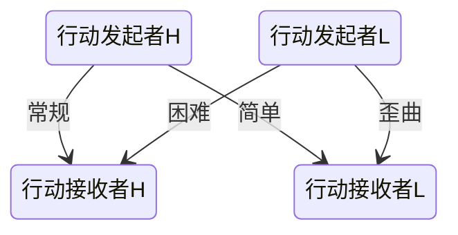

# 购点法、对象、骰子与检定


***MTTT*** *是一个非常简单的规则。看完这一部分，你基本上就已经掌握了本规则的所有要点。*


## 购点法：

在 ***MTTT*** 规则中，我们会使用**购点法**来完成角色卡的建立。对于玩家来说，是他们控制的玩家人物，对于GM来说，则包括了所有的NPC与魔物。是的，*在建立角色卡的时候，你并不需要考虑花费点数以外的任何东西。*

***MTTT***的购点规则也十分简单，在三个购点部分（属性，特质，购物）都对点数的消耗做出了详细的说明：仅仅需要根据说明的数目支付点数即可。对了，在 ***MTTT*** 中，点数更合适的称呼是**灵魂玉**。

如果你想要了解一下 ***MTTT*** 购点法的设计，这也很容易说明。本规则的购点基本遵寻等差递增的方式：即+1需要支付1点，+2需要从+1再支付2点一共$1+2=3 $点。同理，$+7$一共支付$(1+2+...+7) = 28$点。在不同的情境下，则会用上述的数值乘以一个常数，比如：$\times 5$或者$\times 10$。而与增强无关的部分，大多完全相等于点数。

这很简单对吧？我们来看下一个部分吧。

*可选·x100*：为了看上去更加简单， ***MTTT***  规则下的购点以1为基本单位。如果你想要看起来更多些——让玩家们更有满足感；或是发放奖励时更合理些，你可以简单地让灵魂玉的获取和消耗乘以100，也就是以100为基本单位。


## 对象：

在 ***MTTT*** 规则中，所有的一切都是**对象**。这种设计是为了方便后续各种包括魔法少女、魔物和小狗、手枪和长剑等单位的统一化。

在各种单位的说明中，我们会阐明其是属于什么*类*的对象。而各种*类*的属性，将会在对象一章详细声明。这里，你只需要了解两种**对象**即可：**静态对象**与**动态对象**。

顾名思义，**静态对象**指的是不能够做出主动行动的单位，比如一块石头，或者一把长剑，或是一块土地。而**动态对象**指的是正在做出主动行动的单位，比如一位正在格挡敌人攻击的魔法少女，或者一把正在说话的长剑，她们就是动态对象。

到了这里，你肯定已经发现，**静态对象**与**动态对象**并不冲突，如果一位魔法少女能够且正在格挡敌人的攻击，那么她此刻是一个**动态对象**或称**动态单位**，她需要使用**双骰法**来对抗同为**动态对象**的敌人的**双骰法**检定。如果她未能察觉到敌人的攻击或是不准备格挡敌人的攻击等，那么她都没有*对敌人的主动行动响应一个主动行动——此时她被视为一个静态对象*，故将使用这位魔法少女在防御上的**双难度**来对抗敌人的**双骰法**检定。

**动态对象**使用**双骰法**，**静态对象**使用**双难度**。这也很简单对吧？至于为什么会出现*双*，我们看到下一个部分就知道了，这与**优势**和**劣势**有关。


## 骰子与检定：

在 ***MTTT*** 规则中，检定非常简单：不会出现联合检定或是多次检定。*一个行动的成功与否，永远仅需要一次检定。*

### 优势与劣势：

所有的条目，都有**优势**和**劣势**两个子类，通常，**优势**结果与**劣势**结果并不相同。那么，如何判断是优势还是劣势呢？我们需要看在使用骰子与难度时，使用较好的那个还是较差的那个。

### 成功/失败检定：
> 也即是双骰法与双难度

所有的*成功/失败*检定、所有的首次投骰情境，都需要你投掷也仅仅投掷两次**d20**，加上对应的调整值。也即是：

```tex
\begin{aligned}
result_H &= d20 + X_1\\
result_H &= d20 + X_1
\end{aligned}
```

其中，*总调整值X*的范围是$-20\sim20$。若是理论调整值超过了这个数值，则在实际检定中，仍然只有其中的20点有效（这个规则有极高的优先度）。故，任何此种骰子的结果都会在$-19\sim40$内浮动。

投掷完毕后，你会得到两个结果*result1*与*result2* ，这两个结果常常会有一个高（简称为H(*High*)）一个低（简称为L(*Low*)）——这便是**优势骰H**与**劣势骰L**。假设调整值*X*在**优势**与**劣势**下的调整值都一致（通常如此），那么仅有*1/20*的可能，H与L是一致的，在此情况下，我们直接视为H=L。更近一步地，我们看两次骰子的D20的结果，仅有$\frac{1}{400}$的可能性，玩家投出$H_{D20}=L_{D20}=20$或是$H_{D20}=L_{D20}=1$，对于这种情况，我们视为**绝对成功**与**绝对失败**——不再需要响应*行动*，也不需要考虑调整值*X*。

在对象中，我们提到过，所有*行动*的提出方，因为其必然是由一个**动态对象**动态提出，故都需要进行**双骰法**检定。而对于*行动*的接受方，会相应，若是其主动响应了*行动*，则其必然是由一个**动态对象**动态提出，故进行的对抗检定也是**双骰法**检定；而若是*行动*的接受方被动响应了*行动*，则无论其是**动态对象**或是**静态对象**，因为其静态成分，故其是两个固定值（也即**双难度**）。

那么，任何检定，都必定会出现四个数值，两个由行动发起者提供，两个由行动接受者提供。它们的比较关系由下表列出：



可见，一共有四种情况，它们分别意味着，**优势**对抗**优势**，**优势**对抗**劣势**，**劣势**对抗**优势**，**劣势**对抗**劣势**。当你使用**优势骰**，这同时意味着你需要使用**优势**条目下的结算结果。反之，当你当你使用**劣势骰**，这同时意味着你需要使用**劣势**条目下的结算结果。

> 有关**歪曲**判定，现在仅需要知道，这是在和强大魔物战斗的时候使用的判法即可。

具体使用那种对抗形式，根据情况的不同而不一样，但通常，我们都使用**优势**对抗**优势**，因为我们相信任何主动行动者，都会尽力做好自己的行动。


*可选·难度开关*：对于GM而言，这种设计有一个显而易见的调整难度的方式：将所有**常规对抗**改为**困难对抗**、**简单对抗**改为**常规对抗**即可增加难度，反之即可降低难度。但需要注意，这种调整会明显改变游戏的平衡。

*可选·单骰法*：若是GM觉得双骰法还是困难，你可以改为单骰模式。但这真不一定会降低游戏本就很低的复杂度。

>那么，我们再把投骰方法总结一下：
每当你试图进行一个有一定几率失败的动作时，你投两次20面骰子（d20）。
为了检测你的人物是否成功完成动作，你必须：
* 投两次d20
* 在每次d20加上任何相关的调整值
* 确定是优势还是劣势
* 拿结果与目标数值进行比较
>如果结果等于或大于目标数值，你的人物成功。若小于目标数值，那么你失败了。

最后这个好像复杂了一点点，但应该也还好？到了这里，我相信你已经基本懂得这个规则怎么游玩了。

我们正式开始吧？


